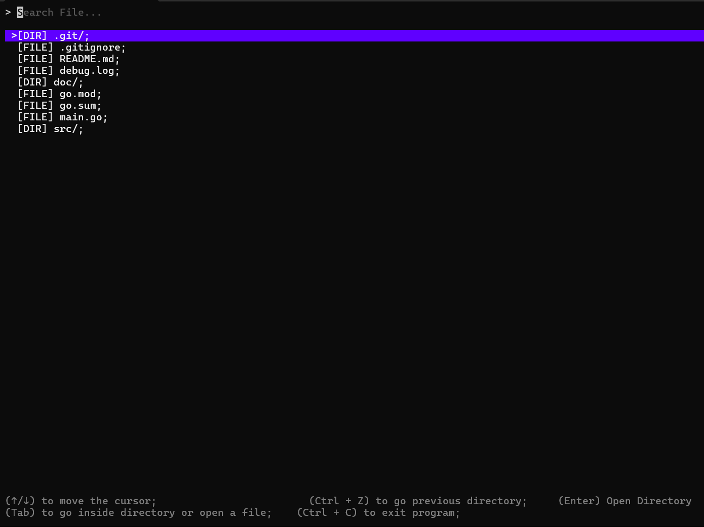

# What this Project About

A Simple File Explorer In Terminal

###  Motivation

the plan is use terminal to the max usage possible, like can i use everything in terminal. so that's the this idea came from a simple file explorer to look up file and directory in the current directory location and of course some basic utility like find file and open file.

### Future Me Todo

- Add Preview if its text related file (but it became beyond simple file explorer, but need to think about it)
- Add Filter (like filter extension file)

## Example

## Built From Scratch Or ??

### Linux

Just type `GOOS=linux go build -o lg-file` and add it into Windows System Variable

### Windows

Just Type `GOOS=windows go build -o lg-file` and add it into Linux Path

`export $PATH:/path/to/file`

### Other

You can specifiy Which architecture cpu you use like

`GOARCH=arm` or `GOARCH=amd64`

### Or

Quickest Way is by `go install github.com/ikhwanal/lg-file` and it will go to your go PATH bin

## Args Can Be Used

`-openDir=string` this allow to open a directory with choosen app, by default it will open file explorer

e.g:

`lg-file -openDir=code` open a directory with command code

